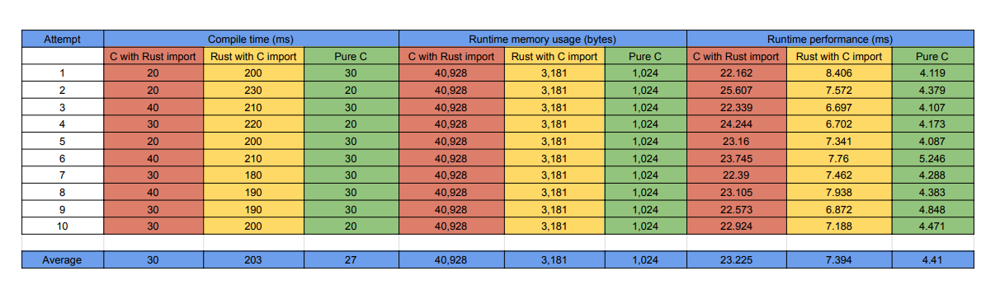

# Task to solve

Benchmark the performance of pure C code without
Rust usage compared with the same functionality of
the C code with Rust usage. Pay attention on
parameters: Compile time, run time memory usage,
run time performance.

# Get started

### Clone the repo

```
git clone git@github.com:danielyandev/c-rust-test.git
```

### Run make to compile libs and classes

```
make
```

If you don't have make, you'll need to run commands manually:

```
# set ld path env variable tocurrent dir
export LD_LIBRARY_PATH=.

# prepare libs
rustc --crate-type cdylib ./merge_sort.rs
gcc -shared -o libmerge_sort_c.so merge_sort.c

# compile
time gcc -o sort_c_with_rust_import sort_c_with_rust_import.c -L. -lmerge_sort -Wl,-rpath,.
time gcc -o sort_pure_c sort_pure_c.c
time rustc -o sort_rust_with_c_import sort_rust_with_c_import.rs -L. -lmerge_sort_c

# run and check runtime and memory usage
valgrind ./sort_c_with_rust_import
valgrind ./sort_pure_c
valgrind ./sort_rust_with_c_import
```

# Implementation

Merge sort algorithm is used in both programs. It was chosen because it uses additional space too.
So the programs have O(nlgn) time complexity and O(n) space complexity.

# Results

As we can see, there is no significant difference in compilation time.
But in runtime performance and memory usage, program written in pure C leads.
It uses 40 times less memory and runs 5 times faster than the same program using Rust.

